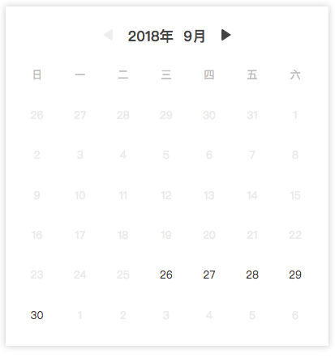

# as-vue-calendar



一个超级轻量的日历组件，目前仅支持选择‘某一天的 0 时 0 分 0秒’

有点大概就是：轻量，无依赖，没有其他乱七八糟的东西

## 如何使用

1. 安装依赖

```sh
npm i as-vue-calendar --save
```

2. 在组件内引用，就是一个单组件啊

```javascript
import calendar from 'as-vue-calendar'

new Vue({
  components: {
    [calendar.name]: calendar
  }
})

<as-vue-calendar :value="2018-9-26" @select="alert($event)" />

```

3. 组件上暴露一个 @select 方法，$event 为 选中日期当天 0 点的一个 Date 对象，至于拿来干什么，请自由发挥

4. 通过 $refs 选中组件，可以使用组件自带的 reset 方法来手动重置翻页状态，日历会回退到 props.value 所对应日期的那个月份，如果 value 为空，则为当前月份 （用来处理某些人翻了半天日历后取消选择的情况）